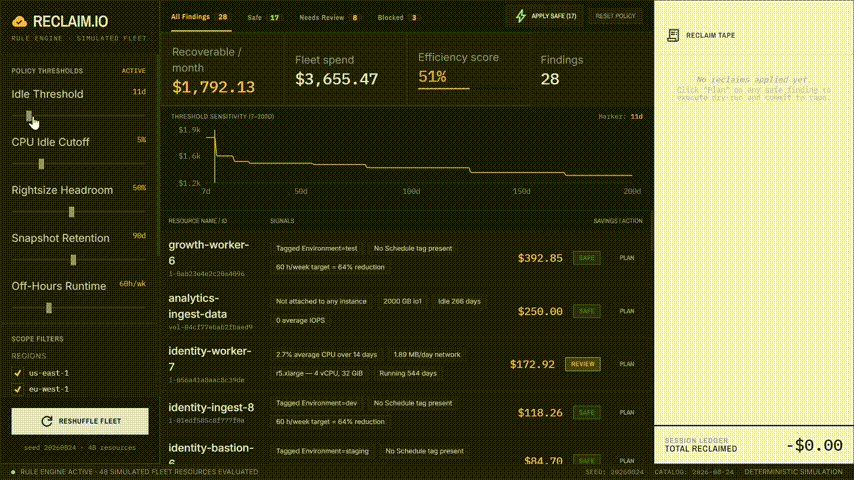

# FinOps Reclaimer

A cloud cost-reclamation console built on a deterministic rule engine. It finds
idle AWS spend, explains why each resource was flagged, and requires a dry-run
before anything is applied.

**[Live demo →](https://YOUR-URL.vercel.app)**



---

## What this is, plainly

The resource inventory is **synthetic**, generated locally from a seed, with no
AWS account behind it.

The pricing and the logic are **real**. Every figure on screen is derived at
runtime from a published rate card and a rule engine you can read in about 200
lines. Nothing is hardcoded, and there is no machine learning or language model
anywhere in the project.

That distinction is the point of the whole thing. A dashboard with invented
numbers is a mockup; a dashboard where you can trace every figure back to an
arithmetic operation is a tool.

## The problem

Cloud bills grow through neglect rather than decision. A volume gets detached
during a migration and keeps billing at full rate. A development cluster is
sized for a load test that ran once. A snapshot outlives the volume it was taken
from by two years. Nobody owns these resources, nothing expires them, and
deleting them feels risky enough that it stays on the backlog.

The tooling problem is not detection, the signals are all in CloudWatch. It is
that a list of flagged resources is not actionable without an explanation, a
cost, and a safe way to act. This console is about that last mile.

## How a recommendation is produced

Every rule is a pure function of shape `(Resource, Policy) => Finding | null`.
No model, no scoring heuristic, no tuned weights. A finding appears when a
resource matches a declarative condition, the same way Cloud Custodian, AWS
Trusted Advisor, and Komiser work.

Take the off-hours scheduling rule. Given `i-0ab23e4e2c20a4096`, an
`m5.4xlarge` in `eu-west-1`, tagged `Environment=test`, with no `Schedule` tag:

```
on-demand rate       $0.768 / hour        (m5.4xlarge, published list price)
hours per month       730
region multiplier      1.09               (eu-west-1 vs us-east-1)
                     ─────────────────────
current run-rate     $611.10 / month

target runtime         60 h/week          (12h × 5 weekdays, policy default)
billed runtime        168 h/week
reduction              1 − 60/168 = 64.3%
                     ─────────────────────
recoverable          $392.85 / month
```

The app displays `$392.85`. You can reproduce that with a calculator, and the
rate is checkable against the AWS pricing page. That is the property the project
is built around.

Or the unattached-volume rule, which is simpler:
`2000 GB × $0.125/GB-month (io1) × 1.0 (us-west-2) = $250.00/month`.

## The rules

| Rule | Fires when | Default confidence |
|---|---|---|
| `ebs-unattached` | Volume detached beyond the idle threshold, zero IOPS | safe |
| `ec2-idle` | Average CPU below cutoff, under 5 MB/day network | review |
| `ec2-oversized` | Peak CPU fits the next size down with headroom to spare | review |
| `ec2-schedule` | Non-prod instance billed 168 h/week with no `Schedule` tag | safe |
| `rds-idle` | Zero peak connections across the window | review |
| `eip-unattached` | Elastic IP allocated but unassociated | safe |
| `snapshot-orphaned` | Source volume gone, past retention | safe |
| `alb-no-targets` | No healthy targets in any target group | review |

One finding per resource, the highest-priority matching rule wins, so a rule
that would terminate an instance is not also offered as a rightsizing.

## Guardrails

Confidence here describes **blast radius**, not statistical certainty:

- **safe** - reversible, or provably unused. Fine to batch.
- **review** - plausible, but a human should confirm intent.
- **risky** - a guardrail tripped. Never auto-applied, and the UI offers no path
  to apply it at all.

Guardrails trip on protected tags (`Environment=prod`, `DoNotDelete`, any
CloudFormation-managed resource) and on anything created within the last seven
days. Blocked findings are excluded from the batch operation at the data layer,
not merely disabled in the interface, filtering happens before the confirmation
dialog is even constructed.

Nothing mutates state without a dry-run. Clicking Apply opens the execution plan
for that resource, the ordered steps a real implementation would run, and
requires explicit confirmation. The batch operation does the same for every
resource in scope.

This is the part of the project I would defend hardest in review. Detection is
the easy half; the reason FinOps automation stalls in practice is that engineers
do not trust a tool that can delete things.

## Determinism

Same seed plus same policy produces byte-identical output, every time. The
inventory generator uses a seeded PRNG (mulberry32), and the engine has no
randomness, no clock reads, and no I/O.

At seed `20260824`, the default policy yields exactly:

| | |
|---|---|
| Fleet spend | $3,655.47 / month |
| Recoverable | $1,459.86 / month |
| Findings | 24 |
| Efficiency score | 60 / 100 |

Change the seed in the left rail to regenerate the fleet; change it back and the
figures above return exactly. The efficiency score is defined, not vibed: it is
the share of total fleet spend *not* flagged as recoverable.

## Assumptions and limitations

Worth stating plainly, because the model does not capture everything:

- **Regional pricing is a flat multiplier.** Real AWS pricing varies per SKU per
  region; this approximates it with one coefficient. Good enough for relative
  comparison, wrong for a real invoice.
- **Utilisation metrics are generated**, not read from CloudWatch. The
  distributions are plausible but not empirical.
- **RDS savings are modelled at 70%** of the line item, because storage
  continues to bill while an instance is stopped and AWS auto-restarts stopped
  instances after seven days. The full compute cost is not recoverable by
  stopping alone.
- **On-demand list prices only.** No Savings Plans, Reserved Instances, Spot, or
  negotiated EDP discounts, all of which would materially change the numbers in
  a real account.
- **No dependency graph.** The engine cannot see that a "detached" volume is
  referenced by a Terraform state file or a registered AMI. The execution plans
  name these checks as steps precisely because the engine cannot perform them.
- **Rates verified against public AWS price lists on `LAST_VERIFIED` in
  `src/data/pricing.ts`.** They drift; treat older dates with suspicion.

## How I'd build this for production

The console is the easy part. A real implementation would need:

**Ingestion.** Cost and Usage Report into Athena for spend attribution, plus
CloudWatch `GetMetricData` for utilisation. CUR lags by up to 24 hours, so
"current run-rate" would need to be computed from instance state rather than
billing data.

**Policy as data.** The `Policy` object moves to Parameter Store or a config
repo, versioned, with per-account and per-team overrides. Teams should be able
to raise their own thresholds without a code change, and the change should be
reviewable.

**Ownership resolution.** Findings are worthless without someone to route them
to. Owner tag first, falling back to CloudTrail creation events, falling back to
the account owner. Untagged resources become their own finding class.

**Execution with a two-person rule.** Dry-run output persisted as an artefact,
approved by someone other than the requester, executed by a Step Functions
workflow that snapshots before it deletes and holds the snapshot past the
deletion. Every step written to an audit log.

**Off-hours scheduling** as a tag-driven EventBridge rule rather than a one-off
action, with a documented opt-out so a team caught out at 2am can disable it
themselves without filing a ticket.

**Feedback loop.** Track which findings are dismissed and why. A rule with a
high dismissal rate is a badly-calibrated rule, and that signal is more valuable
than adding more rules.

## Running locally

```bash
git clone https://github.com/prakhar895/finops-reclaimer.git
cd finops-reclaimer
npm install
npm run dev
```

No API keys, no environment variables, no backend. The engine can also be
exercised without the UI:

```bash
npx tsx verify.ts
```

## Structure

```
src/
├── data/
│   ├── pricing.ts       Rate card, region multipliers, cost helpers
│   ├── rules.ts         Eight rules + the evaluate() engine
│   └── inventory.ts     Seeded synthetic fleet generator
├── types.ts             Resource, Finding, Policy
├── components/          Presentational React components
└── App.tsx              State, derivations, wiring
verify.ts                Terminal harness for the engine
```

The engine has no React dependency and no knowledge of the UI. It could be
lifted into a Lambda unchanged.

## Stack

React 19, TypeScript, Vite, Tailwind, Recharts. UI scaffolded with Google Stitch
and Google AI Studio; the rule engine, pricing model, and state logic are
hand-written and were built and verified before any interface existed.